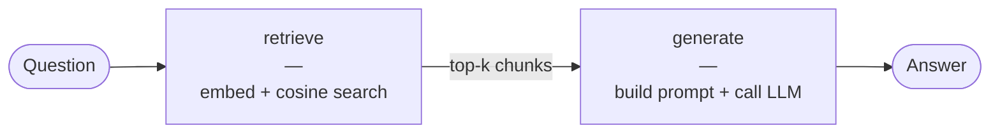

# Chapter 1 · Standard RAG

## The problem: your LLM is confidently wrong

You've got a 200-page technical manual. You ask an LLM: *"What's the maximum torque for the XR-500 motor?"*

The LLM answers confidently. It gives you a specific number. It's completely plausible. And there's a decent chance it's wrong — because that manual wasn't in the model's training data, or the model half-remembered a different motor, or the spec changed after the training cutoff.

This is **hallucination**: the LLM invents plausible-sounding details when it doesn't actually know. It happens because LLMs are trained to produce fluent text that *sounds right*, not to say "I don't know" when uncertain.

**Retrieval-Augmented Generation (RAG)** fixes this by changing the contract: instead of relying on the model's memory, you *retrieve* the relevant passage from your documents first and paste it into the prompt. The model is now grounded — it has the actual answer in front of it.

Standard RAG is the simplest possible version of this idea. It's also the baseline everything else in this repo builds on.

---

## The one-sentence idea

Embed the question, find the most similar chunks in your document store, and paste them into the prompt before asking the LLM.

---

## How it works

The pipeline has two steps:



### Step 1 · `retrieve`

**n8n node: Dense Retrieve**

Your question — "What's the maximum torque for the XR-500 motor?" — gets embedded into a vector, the same way every chunk in your index was embedded when you indexed the document. You then run a cosine similarity search to find the top-k chunks most similar to the question.

```python
# src/rag_lab/architectures/standard/steps.py
def retrieve_step(state: RAGState, deps: PipelineDeps) -> RAGState:
    top_k = deps.extra.get("top_k", 5)
    retriever = DenseRetriever(embedder=deps.embedder, store=deps.store)
    results = retriever.retrieve(state.question, top_k=top_k)
    state.retrieval_results = results
    return state
```

The result is a ranked list of `RetrievalResult` objects — each one is a `Chunk` (a slice of your original document) with a similarity score from 0 to 1. Score of 1 means the chunk is nearly identical to the query in embedding space; lower means less similar.

> **What's an embedding?** A vector — a list of numbers that encodes meaning. Two pieces of text with similar meaning have vectors that point in roughly the same direction (high cosine similarity). See [Embeddings primer](../concepts/embeddings.md).

> **What's a chunk?** A short excerpt of your document (typically 256–512 tokens). You split documents into chunks at indexing time because LLM context windows are limited and because smaller units retrieve more precisely. See [Chunking primer](../concepts/chunking.md).

### Step 2 · `generate`

**n8n node: Generate Answer**

The retrieved chunks and the original question are assembled into a prompt:

```
[System]
You are a helpful assistant. Answer the question using ONLY the provided
context. If the context does not contain enough information, say so.

[User]
Context:
[Source 1]
The XR-500 motor has a maximum continuous torque of 42 N·m at 3,600 RPM.
Peak torque is 68 N·m for intervals up to 5 seconds...

---

[Source 2]
Operating temperature range: −20°C to +80°C. The motor uses Class F insulation...

Question: What is the maximum torque for the XR-500 motor?
```

The LLM sees the actual answer in the context. It now has no reason to hallucinate — the fact is right there.

```python
def generate_step(state: RAGState, deps: PipelineDeps) -> RAGState:
    messages = build_rag_messages(state.question, state.retrieval_results)
    state.answer = deps.llm.complete(messages)
    return state
```

The prompt is built by `generation/generator.py` using the template in `generation/prompts/rag_system.txt`. Keeping prompts in text files means you can copy-paste them directly into n8n LLM nodes without touching Python.

### Indexing (the setup step)

Before you can query, you need to index your documents. The `index()` method runs the pre-processing pipeline:

```
chunk → embed → upsert to Chroma → rebuild BM25
```

```python
pipeline = StandardRAGPipeline(config=cfg)
stats = pipeline.index_file("my_manual.pdf")
# → IndexStats(num_documents=1, num_chunks=147, duration_ms=3421)
```

This only needs to run once (or when your documents change). After that, queries are fast.

---

## Watch it work

Run the example:

```bash
RAGLAB_LLM__PROFILE=ollama \
RAGLAB_LLM__MODEL="ollama/qwen2.5:3b" \
python examples/01_standard_rag.py
```

<!-- TODO: replace with real trace output once example is run against Ollama -->

Here's what a typical trace looks like (values from a local run with `qwen2.5:3b`):

```
── RAG-Lab · Standard RAG Example ──────────────────────────────
   LLM   : ollama/qwen2.5:3b
   Embed : all-MiniLM-L6-v2
   Store : chroma @ .chroma

Indexing corpus: intro_to_rag.txt
  ✓ 1 doc(s) → 18 chunks (3209 ms)

Question: What is the difference between BM25 and dense retrieval?

────────────────────────────────────────────────────────────
ANSWER
────────────────────────────────────────────────────────────
BM25 is a keyword-based retrieval method that scores documents based on
term frequency and inverse document frequency — it works well when the
query contains exact terms present in the document. Dense retrieval uses
neural embeddings to compare the *meaning* of the query and document,
so it can match even when the exact words differ. BM25 is faster and
requires no GPU; dense retrieval handles synonyms and paraphrases better.

────────────────────────────────────────────────────────────
PIPELINE TRACE
────────────────────────────────────────────────────────────
  retrieve               12.4 ms
                              n_retrieved: 5
                              top_score: 0.8231
                              bottom_score: 0.6847
  generate            4 821.3 ms
                              answer_chars: 412
                              answer_preview: BM25 is a keyword-based retrieval...
  TOTAL               4 833.7 ms

────────────────────────────────────────────────────────────
TOP 5 RETRIEVED CHUNKS
────────────────────────────────────────────────────────────
  [0] score=0.8231  BM25 is a classical keyword-based retrieval algorithm. It assigns...
  [1] score=0.7809  Dense retrieval uses a bi-encoder neural network to embed both...
  [2] score=0.7441  Hybrid retrieval combines BM25 and dense vectors, merging their...
  [3] score=0.6993  Vector databases like Chroma and Qdrant store the embeddings...
  [4] score=0.6847  The embedding model maps variable-length text to a fixed-size...
```

A few things to notice in this trace:

**Retrieval took 12 ms.** Sentence-transformers embeds the query in a few milliseconds; Chroma's HNSW index returns 5 results instantly. This is typical.

**Generation took 4.8 seconds.** Almost all the latency is the LLM. On a GPU, this drops to 200–500 ms. On macOS CPU with a 3B model, 3–8 seconds is normal.

**The scores are decent (0.68–0.82).** The question asks about BM25 vs. dense retrieval, and the corpus has exactly that content. When you ask about something *not* in your corpus, scores drop below 0.5 and the answer degrades gracefully.

---

## Watch it strain

Standard RAG has one significant weakness: **it only uses semantic similarity.**

Try this query: *"What does HNSW stand for?"*

The dense embedder might retrieve chunks about "vector search" and "nearest-neighbour indexes" — semantically related, but not the specific acronym expansion. The chunk that says *"HNSW (Hierarchical Navigable Small World)"* has a lower cosine similarity than chunks that talk about vector search in general terms, because "what does X stand for" queries don't embed similarly to definitional sentences.

You'll see this in the trace: the relevant chunk is ranked #3 or #4, and the answer hedges.

This is the retrieval gap: **dense models capture meaning but can miss exact keywords, IDs, and technical terms.** A question like *"What is the recall for chunk_id abc123?"* will never retrieve the right result with dense search alone.

The next chapter fixes this by adding keyword search alongside dense search. → [Chapter 2: Hybrid RAG](hybrid.md)

---

## When to use Standard RAG

**Use it when:**
- Your documents are in natural prose and your questions are phrased naturally.
- You want the simplest thing that can possibly work.
- You're establishing a baseline before adding complexity.
- Latency per query is not critical (dense search adds ~5–15 ms).

**Don't use it when:**
- Your queries contain exact identifiers, product codes, or technical acronyms that dense search misses.
- Your corpus has tables, structured data, or many proper nouns (use Hybrid RAG instead).
- Questions require multi-hop reasoning ("what does the manager of project X earn?").
- The corpus changes in real time (use Streaming RAG instead).

| Dimension | Standard RAG | Notes |
|-----------|-------------|-------|
| Latency | Low (embed + HNSW search ≈ 10–20 ms) | Most time is LLM generation |
| Accuracy | Good on prose | Degrades on exact-match queries |
| Setup cost | Low | One index_file() call |
| Complexity | Minimal | 2 steps, no branching |

---

## Pitfalls

**Chunk size too large or too small.** Chunks that are too long dilute the signal — the embedding averages over too much text. Chunks that are too short lose context. For most prose, 256–512 tokens with ~64-token overlap is a solid starting point. See [Chunking primer](../concepts/chunking.md).

**top_k too low.** If `top_k=1`, you're betting everything on the best single chunk. In practice, the correct answer often spans the 2nd or 3rd chunk. A top_k of 5 is a reasonable default; go higher if your context window allows.

**Forgetting to re-index after document changes.** The vector store and BM25 index are snapshots. If your documents update and you don't re-index, you'll get stale or missing answers. `index()` is idempotent — safe to call again; chunks are upserted by ID.

**Trusting high cosine scores unconditionally.** A score of 0.9 means the chunk *looks similar* to the query in embedding space. It doesn't mean it contains the correct factual answer. Always look at the retrieved text, not just the score.

**Using the wrong embedding model for your domain.** `all-MiniLM-L6-v2` is great for general English prose. For code, legal text, medical literature, or non-English documents, a domain-specific model can dramatically improve retrieval. The embedding model is a config change — no code to touch.

---

## Try it / break it

**Exercise 1 — missing information**
Ask a question that's completely outside the corpus:

```python
result = pipeline.query("What is the capital of France?")
```

Watch the scores drop and the answer either hedge correctly ("The provided documents don't contain...") or hallucinate. This is the grounding contract working.

**Exercise 2 — top_k effect**
Edit `config/default.yaml` and set `retrieval.top_k: 1`. Ask the same question and compare the answer quality. You're now giving the LLM only the single best chunk — sometimes perfect, sometimes dangerously incomplete.

**Exercise 3 — indexing your own documents**
Point the indexer at anything you have:

```bash
rag-lab index /path/to/your/documents/
rag-lab query "What does this document say about X?"
```

Notice how the retrieved chunk quality changes for technical jargon vs. natural prose questions.

---

## Recap

Standard RAG is the simplest complete RAG pipeline:

1. **Index**: split docs into chunks → embed → store in Chroma
2. **Query**: embed question → cosine search → paste top-k chunks into prompt → call LLM

It fixes hallucination by grounding the LLM in your documents. It's fast, simple, and the right starting point.

Its weakness is that dense search captures *meaning* but misses *exact keywords*. That gap motivates the next chapter.

## Further reading

- **Original RAG paper**: Lewis et al., [Retrieval-Augmented Generation for Knowledge-Intensive NLP Tasks](https://arxiv.org/abs/2005.11401) (2020) — the paper that named the pattern
- **Sentence Transformers**: [sbert.net](https://www.sbert.net/) — the library behind `all-MiniLM-L6-v2` and friends
- **ChromaDB docs**: [docs.trychroma.com](https://docs.trychroma.com/) — how Chroma stores and searches embeddings
- **HNSW explained**: Malkov & Yashunin, [Efficient and robust approximate nearest neighbor search](https://arxiv.org/abs/1603.09320) — if you want to know how the vector search actually works
