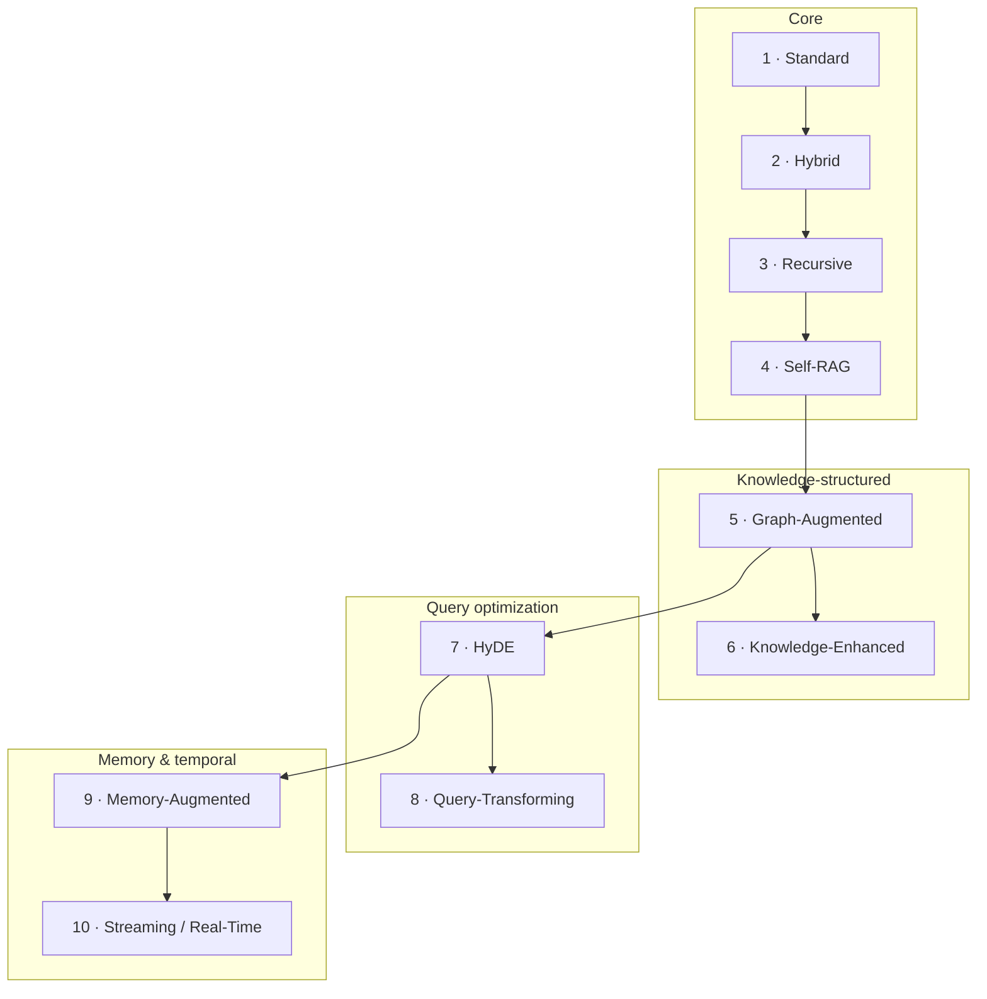

# Learning path

RAG-Lab is built to be read like a course. Each chapter starts from a problem the previous one couldn't handle, so reading in order is the fastest way to build a real mental model. You can also jump straight to a chapter — but skim the prerequisites it links to.

## Before you start

You need: comfort with Python, an LLM API key (or [Ollama](https://ollama.com) for fully-local runs), and ~20 minutes for the [quickstart](../README.md#60-second-quickstart). You do **not** need any prior RAG knowledge — that's what this is for.

## Prerequisite primers (read as needed)

Short, standalone explainers the chapters link to instead of re-explaining:

- `concepts/embeddings.md` — turning text into vectors, and what "similarity" means
- `concepts/chunking.md` — why and how documents get split
- `concepts/vector-search.md` — nearest-neighbour search, top-k
- `concepts/bm25.md` — old-school keyword search, and why it still matters
- `concepts/fusion-rrf.md` — merging two ranked lists (Reciprocal Rank Fusion)
- `concepts/reranking.md` — a second, smarter pass over candidates
- `concepts/llm-as-judge.md` — how we score answers in evaluation

<!-- TODO: link these as they are written (Phases 0.5–1). -->

## The curriculum

**Recommended order:** 1 → 10, top to bottom. The Core four are the backbone — do those first even if you came for something later.

| # | Chapter | One-line hook |
|---|---------|----------------|
| 1 | [Standard RAG](architectures/standard.md) | retrieve, then answer — the baseline everything builds on |
| 2 | [Hybrid RAG](architectures/hybrid.md) | add keyword search so exact terms stop slipping through |
| 3 | [Recursive RAG](architectures/recursive.md) | retrieve again based on what you just learned |
| 4 | [Self-RAG](architectures/self_rag.md) | let the model judge its own retrieval and answer |
| 5 | [Graph-Augmented RAG](architectures/graph.md) | follow relationships, not just similarity |
| 6 | [Knowledge-Enhanced RAG](architectures/knowledge_enhanced.md) | constrain answers with schemas and rules |
| 7 | [HyDE](architectures/hyde.md) | imagine the answer first, then search with it |
| 8 | [Query-Transforming RAG](architectures/query_transform.md) | rewrite, split, and route the question |
| 9 | [Memory-Augmented RAG](architectures/memory_rag.md) | remember across turns and sessions |
| 10 | [Streaming / Real-Time RAG](architectures/streaming.md) | retrieve over data that won't sit still |

<!-- TODO: links go live as each chapter lands. -->

## After the chapters

- **Compare them head-to-head** — the comparison chapter runs all architectures on the same questions with real latency/cost/accuracy numbers.
- **Rebuild in n8n** — each chapter has a matching [n8n spec](n8n/) mapping its steps to nodes, so you can reconstruct it without writing Python.
